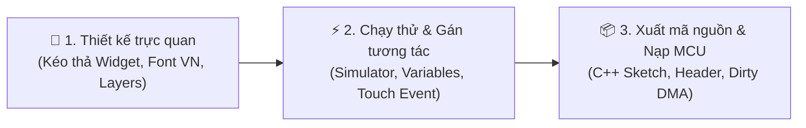

<div align="center">

# 🖥️ LCD_Studio

### **Bộ công cụ thiết kế giao diện đồ họa LCD/TFT & HMI chuyên nghiệp cho Hệ thống Nhúng**
*Trực quan hóa thiết kế — Tối ưu tài nguyên vi điều khiển — Sinh mã C++ / Arduino tự động 1-Click*

[](https://github.com/)
[](LICENSE)
[](https://github.com/)
[](https://react.dev/)
[](https://www.python.org/)
[](https://github.com/)

---

[Tính năng nổi bật](#-tính-năng-đột-phá) •
[Hệ thống phần cứng](#-phần-cứng--màn-hình-hỗ-trợ) •
[Bắt đầu nhanh](#-khởi-chạy-nhanh) •
[Quy trình thiết kế](#-quy-trình-làm-việc-3-bước) •
[Mã nguồn mẫu](#-mã-nguồn-nhúng-sinh-ra) •
[Kiến trúc](#-kiến-trúc-hệ-thống)

---

</div>

## 💡 Giới thiệu

Việc lập trình giao diện màn hình cho vi điều khiển (ESP32, STM32, Arduino, RP2040...) trước đây là một cơn ác mộng: kỹ sư phải **ngồi tính từng tọa độ pixel bằng tay**, vất vả tạo nút bấm, căn lề văn bản, xử lý font chữ tiếng Việt bị lỗi dấu, và đau đầu với hiện tượng màn hình nhấp nháy do quét lại toàn bộ framebuffer.

**LCD_Studio** sinh ra để xóa bỏ hoàn toàn rào cản đó!

Kết hợp sức mạnh thiết kế linh hoạt của **React 19 + Canvas 2D** cùng bộ lõi xử lý nhúng chuyên sâu bằng **Python (FreeType, Native Emitter)**, **LCD_Studio** mang đến trải nghiệm thiết kế giao diện mượt mà như Figma nhưng đầu ra lại là **mã nguồn C++ thuần túy, siêu nhẹ và tối ưu bộ nhớ** cho vi điều khiển.

---

## 🌟 Tính năng đột phá

### 🎨 1. Không gian thiết kế trực quan (Visual Canvas Designer)
* **Kéo thả mượt mà:** Trải nghiệm thiết kế Canvas 2D siêu tốc, hỗ trợ Pan/Zoom vô cực, thước đo, lưới tọa độ Snap-to-Grid và vạch căn chỉnh thông minh (Smart Guides).
* **Đa màn hình (Multi-Screen Simulator):** Thiết kế nhiều trang màn hình (Home, Settings, Dashboard, Popup...) trong cùng một dự án.
* **Quản lý Layer & Component:** Phân cấp cây thư mục Layer, nhóm (Group), khóa/ẩn, nhân đôi (Duplicate) và lưu Component tái sử dụng.
* **Hệ thống Lịch sử chuyên nghiệp:** Hỗ trợ Undo/Redo lên tới **80 bước**, an toàn tuyệt đối khi thao tác.

### ⚡ 2. Kho Widget đồ sộ (48+ Widgets chuyên dụng cho IoT)
LCD_Studio cung cấp sẵn thư viện widget phong phú được chia theo danh mục:
* **Cơ bản (Basic):** Văn bản (Label/Text), Hình chữ nhật bo góc (Rectangle/Panel), Nút bấm (Button), Vòng tròn (Circle), Đường thẳng (Line), Icon Unicode.
* **Điều khiển & Nhập liệu (Input):** Thanh trượt (Slider), Núm xoay (Knob), Công tắc gạt (Switch/Toggle), Hộp kiểm (Checkbox), Nút chọn (Radio), Danh sách chọn (Dropdown), Hộp nhập liệu số/văn bản.
* **Hiển thị & Giám sát (Display):** Thanh tiến trình (Progress Bar), Vòng tiến trình (Circular Progress), Đồng hồ đo (Gauge/Arc), Báo pin (Battery), Trạng thái kết nối (Status Indicator), Đèn LED.
* **Biểu đồ dữ liệu thời gian thực (Data & Charts):** Biểu đồ đường (Line Chart), Biểu đồ cột (Bar Chart), **Đồ thị thời gian thực (Realtime Graph)** tự động vẽ lại khi có biến thay đổi, Bảng biểu (Table/List).
* **Cảm biến & IoT chuyên sâu:** Nhiệt độ (°C), Độ ẩm (%), Điện áp (V), Dòng điện (A), Tốc độ vòng tua (RPM), Cường độ sóng (WiFi / BLE / Signal).

### 👆 3. Cơ chế cảm ứng & Tương tác thông minh (Touch & Interaction Engine)
* **Tương tác trực quan:** Gán sự kiện cảm ứng (`click`, `press`, `release`, `long-press`, `swipe`, `enter`) chỉ bằng vài cú nhấp chuột.
* **Điều hướng màn hình (Navigation):** Chuyển trang mượt mà, hỗ trợ ngăn xếp Back-stack, mở Popup thông báo và đóng Popup.
* **Ràng buộc dữ liệu (Data Binding):** Gán biến toàn cục hoặc cục bộ (`temperature`, `relay_state`...) vào thuộc tính widget. Khi dữ liệu vi điều khiển cập nhật, giao diện sẽ tự động đổi màu, đổi giá trị hoặc ẩn/hiện.

### 🔤 4. Quản lý Font & Tiếng Việt đỉnh cao (Vietnamese Font Banking)
* **Đọc trực tiếp font TTF/OTF:** Tự động quét kho font cục bộ, kiểm tra độ phủ Unicode tiếng Việt chuẩn xác.
* **Khắc phục giới hạn 64 KiB của Adafruit_GFX:** Thuật toán **Font Bitmap Banking** độc quyền tự động chia bank 32-bit cho các bộ font chữ lớn và font tiếng Việt đầy đủ dấu mà vẫn giữ nguyên chữ sắc nét, không bao giờ gây tràn bộ nhớ hay lỗi biên dịch.
* **Xuất Header Font (.h) độc lập:** Xuất mã nguồn font bitmap monochrome sắc nét để dùng riêng cho bất kỳ dự án C/C++ nào.

### 🚀 5. Thuật toán làm mới cục bộ (Partial Refresh & Dirty Planner)
* **Nói KHÔNG với nhấp nháy màn hình:** Thuật toán `lcd_dirty.h` tính toán chính xác vùng biên thay đổi (dirty region) giữa trạng thái cũ và mới.
* **Tối ưu DMA:** Chỉ truyền đúng vùng pixel thay đổi qua bus SPI/8080 kết hợp cơ chế DMA (Direct Memory Access), giúp tốc độ khung hình (FPS) mượt mà tối đa ngay cả trên vi điều khiển cấu hình khiêm tốn.

### 📦 6. Xuất mã nguồn trọn gói 1-Click (Native C++ Export)
* **Một cú nhấp chuột — Có ngay toàn bộ Project:**
  * File sketch chính (`.ino`)
  * Cấu hình thiết bị & màn hình riêng biệt (`src/screens/HomeScreen.cpp`, `.h`)
  * Trình điều khiển phần cứng đã tối ưu hóa
  * Toàn bộ mảng font chữ và hình ảnh nhúng (RGB565 PROGMEM)
  * Thư viện nhúng tương thích đi kèm
* **Xuất Offline Web Runtime:** Đóng gói toàn bộ dự án thành file HTML/JS duy nhất mở trực tiếp bằng trình duyệt để demo hoặc nhúng vào web server của thiết bị IoT.

---

## 📟 Phần cứng & Màn hình hỗ trợ

| Thành phần | Danh mục phần cứng hỗ trợ |
| :--- | :--- |
| **Vi điều khiển (MCU)** | ESP32, ESP32-S3, ESP32-C3, STM32 (F1/F4), Raspberry Pi Pico (RP2040), Arduino Due/Mega |
| **IC điều khiển hiển thị (LCD Driver)** | **ST7796S** (SPI & 8080 Parallel), **ST7789**, **ILI9341**, **ST7735**, **SSD1306** (OLED), **GC9A01** (Màn tròn), RGB Parallel panels |
| **IC Cảm ứng (Touch Controller)** | **GT911** (Điện dung đa điểm - Capacitive), **XPT2046** (Điện trở - Resistive), **FT6236** |
| **Độ phân giải chuẩn có sẵn** | 480×320 (3.5"), 320×240 (2.8"), 240×240 (1.28"), 800×480 (5.0"), 160×128 (1.8"), 128×64 (0.96"), Tùy chỉnh tự do (Custom) |

---

## 🚀 Khởi chạy nhanh

### Yêu cầu hệ thống:
* **Node.js** (v18+) và **Python** (v3.10+)

### Cài đặt và chạy:

```powershell
# 1. Di chuyển vào thư mục dự án
cd C:\DATA_Lionheart\PROJECT\LCD_Studio

# 2. Cài đặt các gói phụ thuộc
npm ci
python -m pip install -r requirements.txt

# 3. Build mã nguồn Frontend
npm run build

# 4. Khởi chạy Desktop App (Cửa sổ ứng dụng độc lập qua PyWebView)
python desktop_app.py
```

> 💡 **Mẹo:** Bạn cũng có thể chạy máy chủ local và mở trên trình duyệt web:
> ```powershell
> python server.py 5174
> # Sau đó mở trình duyệt tại: http://127.0.0.1:5174
> ```

---

## 🛠️ Quy trình làm việc 3 bước



1. **Thiết kế:** Kéo thả các widget từ bảng công cụ bên trái vào màn hình LCD. Căn chỉnh vị trí, màu sắc, font chữ và hình ảnh ở bảng Inspector bên phải.
2. **Xem trước (Preview):** Nhấn phím `Shift + Enter` để bật chế độ mô phỏng tương tác. Bấm nút, kéo thanh trượt, thử nghiệm hiệu ứng chuyển trang và thay đổi giá trị cảm biến ảo.
3. **Xuất mã nguồn (Export):** Chọn **Export** -> Đặt tên dự án và chọn thư mục lưu. Ứng dụng sẽ tự động sinh đầy đủ sketch Arduino, font và thư viện tương thích. Chỉ cần mở bằng Arduino IDE / PlatformIO và nạp vào mạch!

---

## 💻 Mã nguồn nhúng sinh ra

Mã nguồn C++ do LCD_Studio sinh ra cực kỳ tinh gọn, dễ hiểu và dễ tích hợp vào firmware hiện có của bạn:

```cpp
#include "lcd_studio.h"

void setup() {
    Serial.begin(115200);
    
    // Khởi tạo phần cứng màn hình & cảm ứng
    ui_init();
}

void loop() {
    // 1. Đọc dữ liệu từ cảm biến thực tế
    float currentTemp = readTemperatureSensor();
    
    // 2. Cập nhật biến giao diện — LCD_Studio tự động phát hiện vùng thay đổi!
    ui_setVariable("temperature", String(currentTemp, 1));
    
    // 3. Xử lý cảm ứng GT911/XPT2046 và quét vẽ lại vùng dirty qua DMA
    ui_tick();
    
    delay(10);
}
```

---

## ⌨️ Phím tắt tiện ích

| Phím tắt | Chức năng |
| :---: | :--- |
| `Ctrl + N` / `Ctrl + O` | Tạo dự án mới / Mở dự án có sẵn |
| `Ctrl + S` / `Ctrl + Shift + S` | Lưu dự án / Lưu dự án thành bản sao mới |
| `Ctrl + Z` / `Ctrl + Y` | Hoàn tác (Undo) / Làm lại (Redo) |
| `Ctrl + C` / `Ctrl + V` / `Ctrl + D` | Sao chép / Dán / Nhân đôi Widget |
| `Delete` / `Backspace` | Xóa đối tượng đang chọn |
| `Ctrl + G` / `Ctrl + Shift + G` | Nhóm (Group) / Rã nhóm (Ungroup) |
| `Space + Kéo chuột` | Di chuyển vùng làm việc (Pan Canvas) |
| `Ctrl + Phím cuộn chuột` | Phóng to / Thu nhỏ (Zoom in/out) |
| `Ctrl + 0` / `Ctrl + 1` | Xem vừa khung (Fit) / Xem tỉ lệ gốc 100% |
| `Shift + Enter` | Bật / Tắt chế độ chạy thử nghiệm (Live Preview) |
| `Chuột phải` | Mở menu thao tác nhanh ngữ cảnh (Context Menu) |

---

## 🏗️ Kiến trúc hệ thống

```
LCD_Studio/
├── src/                      # Frontend Editor (React 19 + Canvas 2D Engine)
│   ├── studio/
│   │   ├── CanvasScreen.jsx  # Renderer Canvas 2D vẽ đồ họa LCD cực nhanh
│   │   ├── widgetRegistry.js # Định nghĩa cấu trúc 48+ Widget chuyên dụng
│   │   ├── runtime.js        # Engine mô phỏng sự kiện, biến số và điều hướng
│   │   ├── geometry.js       # Thuật toán tính toán vùng biên và căn chỉnh
│   │   └── Inspector.jsx     # Bảng điều khiển thuộc tính và tương tác
├── runtime/                  # C++ Engine nhúng siêu nhẹ
│   └── lcd_dirty.h           # Thuật toán Dirty Region Planner & Flush DMA
├── native_export.py          # Bộ sinh mã C++ chuẩn tối ưu cho Arduino / ESP32
├── server.py                 # Backend Python xử lý FreeType font & HTTP API
├── desktop_app.py            # Ứng dụng Desktop chạy offline qua PyWebView
└── build_exe.py              # Đóng gói bộ cài độc lập .EXE bằng PyInstaller
```

---

## 🤝 Đóng góp & Phát triển

Mọi ý kiến đóng góp, báo lỗi (Issues) hoặc yêu cầu tính năng mới (Feature Requests) đều được hoan nghênh nồng nhiệt!
Hãy tạo Pull Request hoặc gửi issue để cùng nhau hoàn thiện bộ công cụ thiết kế HMI nhúng tốt nhất cho cộng đồng Maker và Kỹ sư IoT.

---

<div align="center">

**Phát triển với ❤️ dành riêng cho Cộng đồng Kỹ sư Nhúng & IoT**  
*Bản quyền © 2026 LCD_Studio. Giữ toàn quyền phát triển.*

</div>
