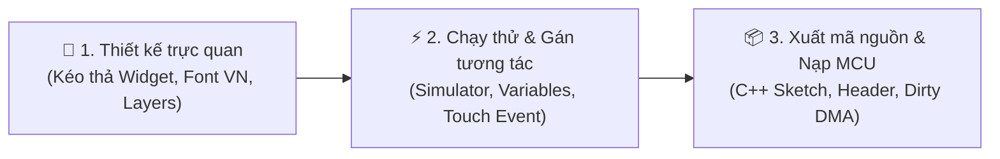

<div align="center">

# 🖥️ LCD Studio

### Visual LCD/TFT & HMI GUI Designer for ESP32, Arduino, STM32 — Free, Portable, Offline
**Bộ công cụ thiết kế giao diện LCD/TFT & HMI cho vi điều khiển — kéo thả, hỗ trợ tiếng Việt, xuất mã C++ / Arduino 1-Click**

[](https://github.com/YOUR_USERNAME/LCD_Studio/releases)
[](https://github.com/YOUR_USERNAME/LCD_Studio/stargazers)
[](https://github.com/YOUR_USERNAME/LCD_Studio/releases)
[-0284c7?style=for-the-badge&logo=windows11)](https://github.com/YOUR_USERNAME/LCD_Studio/releases)
[](https://github.com/YOUR_USERNAME/LCD_Studio/releases)
[](LICENSE)

**English** • **Tiếng Việt** (cuộn xuống)

[Download](#-tải-về--chạy-ngay) •
[Features](#-tính-năng-đột-phá) •
[Hardware](#-phần-cứng--màn-hình-hỗ-trợ) •
[Workflow](#-quy-trình-làm-việc-3-bước) •
[Generated code](#-mã-nguồn-nhúng-sinh-ra) •
[FAQ](#-câu-hỏi-thường-gặp-faq)

</div>

<!-- TODO: thêm ảnh chụp màn hình / GIF demo ngay đây (rất quan trọng để thu hút người xem)
<p align="center"></p>
-->

---

## 🌐 What is LCD Studio? (English)

**LCD Studio** (also written *LCD_Studio*) is a free, portable **visual GUI designer for LCD / TFT / OLED displays and HMI touch screens** on embedded systems. Drag and drop 48+ widgets, simulate touch interaction, then export clean **C++ / Arduino code** for **ESP32, ESP32-S3, STM32, Raspberry Pi Pico (RP2040) and Arduino**.

- 🎨 Figma-like drag & drop canvas, multi-screen projects, layers, undo/redo
- ⚡ 48+ IoT widgets: button, slider, gauge, graph, chart, switch, battery, WiFi signal...
- 🔤 Full **Vietnamese font** support with bitmap banking (beats the 64 KiB `Adafruit_GFX` font limit)
- 🚀 Partial refresh (dirty-region) + DMA for flicker-free, high-FPS updates
- 📟 Drivers: ST7796S, ST7789, ILI9341, ST7735, SSD1306, GC9A01 — Touch: GT911, XPT2046, FT6236
- 📦 One-click export: `.ino` sketch, screens, fonts, images (RGB565 PROGMEM), drivers
- 💾 Single `LCD_Studio.exe`, offline, no Node.js / Python needed

> Looking for an **LCD GUI designer**, **TFT UI builder**, **Arduino display designer**, **ESP32 HMI editor** or a lightweight alternative to heavier UI toolchains? You're in the right place. ⭐ Star the repo if it helps you!

---

## 💡 Giới thiệu (Tiếng Việt)

Lập trình giao diện màn hình cho vi điều khiển (ESP32, STM32, Arduino, RP2040...) trước đây rất cực nhọc: phải **tính từng tọa độ pixel bằng tay**, tạo nút bấm, căn lề văn bản, xử lý font tiếng Việt bị lỗi dấu và đau đầu với hiện tượng màn hình nhấp nháy do quét lại toàn bộ màn hình.

**LCD Studio** (LCD_Studio) xóa bỏ rào cản đó! Phần mềm phát hành dưới dạng **ứng dụng Portable duy nhất (`LCD_Studio.exe`)**: tải về, nhấp đúp là dùng — **không cần cài đặt** Node.js hay Python. Giao diện kéo-thả mượt như Figma, đầu ra là **mã C++ thuần túy, siêu nhẹ, tối ưu bộ nhớ**.

---

## ⚡ Tải về & Chạy ngay

> 🚀 **Hoàn toàn Portable:** không cần quyền Administrator, không ghi vào Registry, copy vào USB chạy trên mọi máy Windows!

1. **Tải về:** lấy **`LCD_Studio.exe`** (hoặc `LCD_Studio_Portable.zip`) tại mục [Releases](https://github.com/YOUR_USERNAME/LCD_Studio/releases).
2. **Khởi chạy:** nhấp đúp vào **`LCD_Studio.exe`**.
3. **Bắt đầu thiết kế:** vào **File → Mở dự án mẫu IoT** để trải nghiệm ngay.

---

## 🌟 Tính năng đột phá

### 🎨 1. Không gian thiết kế trực quan (Visual Canvas Designer)
* **Kéo thả mượt mà:** Canvas 2D tốc độ cao, Pan/Zoom, thước đo, lưới Snap-to-Grid và Smart Guides.
* **Đa màn hình (Multi-Screen):** nhiều trang (Home, Settings, Dashboard, Popup...) trong cùng một dự án.
* **Quản lý Layer & Component:** cây Layer, Group, khóa/ẩn, nhân đôi, lưu Component tái sử dụng.
* **Undo/Redo an toàn:** lưu tới **80 bước** lịch sử.

### ⚡ 2. Kho Widget đồ sộ (48+ Widgets cho IoT)
* **Cơ bản:** Text/Label, Rectangle/Panel, Button, Circle, Line, Icon Unicode.
* **Điều khiển & nhập liệu:** Slider, Knob, Switch/Toggle, Checkbox, Radio, Dropdown, ô nhập số/văn bản.
* **Hiển thị & giám sát:** Progress Bar, Circular Progress, Gauge/Arc, Battery, Status Indicator, LED.
* **Biểu đồ thời gian thực:** Line Chart, Bar Chart, **Realtime Graph**, Table/List.
* **Cảm biến & IoT:** Nhiệt độ (°C), Độ ẩm (%), Điện áp (V), Dòng điện (A), RPM, WiFi / BLE / Signal.

### 👆 3. Cảm ứng & tương tác thông minh (Touch & Interaction Engine)
* **Sự kiện cảm ứng:** `click`, `press`, `release`, `long-press`, `swipe`, `enter` gán chỉ bằng vài cú nhấp.
* **Điều hướng màn hình:** chuyển trang, Back-stack, mở/đóng Popup.
* **Data Binding:** gán biến (`temperature`, `relay_state`...) vào thuộc tính widget; dữ liệu đổi thì giao diện tự đổi màu, giá trị, ẩn/hiện.

### 🔤 4. Font & tiếng Việt đỉnh cao (Vietnamese Font Banking)
* **Đọc trực tiếp font TTF/OTF**, kiểm tra độ phủ Unicode tiếng Việt.
* **Vượt giới hạn 64 KiB của Adafruit_GFX** bằng thuật toán **Font Bitmap Banking** (chia bank 32-bit), chữ vẫn sắc nét, không tràn bộ nhớ.
* **Xuất Header Font (`.h`) độc lập** để dùng cho mọi dự án C/C++.

### 🚀 5. Làm mới cục bộ (Partial Refresh & Dirty Planner)
* **Không nhấp nháy:** `lcd_dirty.h` tính chính xác vùng thay đổi (dirty region) giữa hai trạng thái.
* **Tối ưu DMA:** chỉ truyền vùng pixel thay đổi qua SPI/8080 + DMA để FPS cao ngay cả trên MCU khiêm tốn.

### 📦 6. Xuất mã nguồn trọn gói 1-Click (Native C++ Export)
* File sketch chính (`.ino`)
* Cấu hình thiết bị & từng màn hình (`src/screens/HomeScreen.cpp`, `.h`)
* Driver phần cứng đã tối ưu
* Font và hình ảnh nhúng (RGB565 PROGMEM)
* Thư viện tương thích đi kèm
* **Offline Web Runtime:** đóng gói dự án thành một file HTML/JS mở trực tiếp bằng trình duyệt để demo hoặc nhúng vào web server của thiết bị IoT.

---

## 📟 Phần cứng & Màn hình hỗ trợ

| Thành phần | Danh mục hỗ trợ |
| :--- | :--- |
| **Vi điều khiển (MCU)** | ESP32, ESP32-S3, ESP32-C3, STM32 (F1/F4), Raspberry Pi Pico (RP2040), Arduino Due/Mega |
| **LCD Driver IC** | **ST7796S** (SPI & 8080 Parallel), **ST7789**, **ILI9341**, **ST7735**, **SSD1306** (OLED), **GC9A01** (màn tròn), RGB Parallel panels |
| **Touch Controller** | **GT911** (điện dung), **XPT2046** (điện trở), **FT6236** |
| **Độ phân giải có sẵn** | 480×320 (3.5"), 320×240 (2.8"), 240×240 (1.28"), 800×480 (5.0"), 160×128 (1.8"), 128×64 (0.96"), Custom |

---

## 🛠️ Quy trình làm việc 3 bước



1. **Thiết kế:** kéo widget từ bảng bên trái vào màn hình; chỉnh vị trí, màu, font, hình ảnh ở Inspector bên phải.
2. **Xem trước:** nhấn `Shift + Enter` để mô phỏng tương tác — bấm nút, kéo slider, thử chuyển trang và đổi giá trị cảm biến ảo.
3. **Xuất mã nguồn:** chọn **Export**, đặt tên dự án và thư mục lưu. Mở bằng Arduino IDE / PlatformIO rồi nạp vào mạch.

---

## 💻 Mã nguồn nhúng sinh ra

```cpp
#include "lcd_studio.h"

void setup() {
    Serial.begin(115200);

    // Khởi tạo phần cứng màn hình & cảm ứng
    ui_init();
}

void loop() {
    // 1. Đọc dữ liệu từ cảm biến thực tế
    float currentTemp = readTemperatureSensor();

    // 2. Cập nhật biến giao diện — LCD Studio tự phát hiện vùng thay đổi
    ui_setVariable("temperature", String(currentTemp, 1));

    // 3. Xử lý cảm ứng GT911/XPT2046 và vẽ lại vùng dirty qua DMA
    ui_tick();

    delay(10);
}
```

---

## 🔤 Tùy biến & thêm font chữ mới

LCD Studio có sẵn 20 bộ font tiếng Việt và tiếng Anh. Để thêm font riêng:

1. Tạo thư mục `VN/` (font tiếng Việt) hoặc `EN/` (font tiếng Anh) **ngay cạnh `LCD_Studio.exe`**.
2. Chép các file `.ttf` / `.otf` vào đó.
3. Mở lại phần mềm (hoặc bấm **Refresh Fonts** trong tab Fonts) — font mới sẽ tự xuất hiện.

---

## ⌨️ Phím tắt

| Phím tắt | Chức năng |
| :---: | :--- |
| `Ctrl + N` / `Ctrl + O` | Dự án mới / Mở dự án |
| `Ctrl + S` / `Ctrl + Shift + S` | Lưu / Lưu thành bản sao |
| `Ctrl + Z` / `Ctrl + Y` | Undo / Redo |
| `Ctrl + C` / `Ctrl + V` / `Ctrl + D` | Sao chép / Dán / Nhân đôi Widget |
| `Delete` / `Backspace` | Xóa đối tượng đang chọn |
| `Ctrl + G` / `Ctrl + Shift + G` | Group / Ungroup |
| `Space + Kéo chuột` | Pan canvas |
| `Ctrl + Cuộn chuột` | Zoom in/out |
| `Ctrl + 0` / `Ctrl + 1` | Fit / 100% |
| `Shift + Enter` | Bật/tắt Live Preview |
| `Chuột phải` | Context Menu |

---

## ❓ Câu hỏi thường gặp (FAQ)

**LCD Studio là gì?**
Là phần mềm miễn phí để thiết kế giao diện LCD/TFT/OLED và HMI cảm ứng cho vi điều khiển bằng kéo-thả, sau đó xuất mã C++ / Arduino.

**LCD Studio có miễn phí không? Có cần cài đặt không?**
Có, miễn phí và Portable — chỉ một file `LCD_Studio.exe`, chạy offline, không cần Node.js hay Python.

**LCD Studio có hỗ trợ ESP32 và Arduino không?**
Có: ESP32 / S3 / C3, STM32, RP2040, Arduino Due/Mega (xem bảng phần cứng ở trên).

**Có hiển thị được tiếng Việt có dấu không?**
Có. Thuật toán Font Bitmap Banking xử lý font tiếng Việt đầy đủ dấu, vượt giới hạn 64 KiB của Adafruit_GFX.

**Tải LCD Studio ở đâu?**
Tại mục [Releases](https://github.com/YOUR_USERNAME/LCD_Studio/releases) của repository này.

**Màn hình/IC cảm ứng nào được hỗ trợ?**
ST7796S, ST7789, ILI9341, ST7735, SSD1306, GC9A01; cảm ứng GT911, XPT2046, FT6236.

---

## 🤝 Đóng góp & hỗ trợ

- ⭐ **Star** repo để ủng hộ dự án và giúp nhiều người tìm thấy hơn.
- 🐛 Báo lỗi / đề xuất tính năng tại [Issues](https://github.com/YOUR_USERNAME/LCD_Studio/issues).
- 🔀 Pull Request luôn được chào đón.

<details>
<summary><strong>🔧 Dành cho nhà phát triển (build từ mã nguồn)</strong></summary>

```powershell
# 1. Cài thư viện
npm ci
python -m pip install -r requirements.txt

# 2. Build Frontend
npm run build

# 3. Đóng gói LCD_Studio.exe độc lập
python build_exe.py --onefile
```
File thành phẩm nằm tại `release/LCD_Studio.exe`.
</details>

---

<div align="center">

**Keywords:** LCD Studio · LCD_Studio · LCD Studio GitHub · LCD GUI designer · TFT UI designer · Arduino display designer · ESP32 HMI · STM32 LCD · ST7796S · ST7789 · ILI9341 · GT911 · Vietnamese font for LCD · Adafruit_GFX · embedded GUI · touch screen UI builder

**Phát triển với ❤️ dành cho cộng đồng kỹ sư Nhúng & IoT**
*© 2026 LCD Studio — [MIT License](LICENSE)*

</div>
